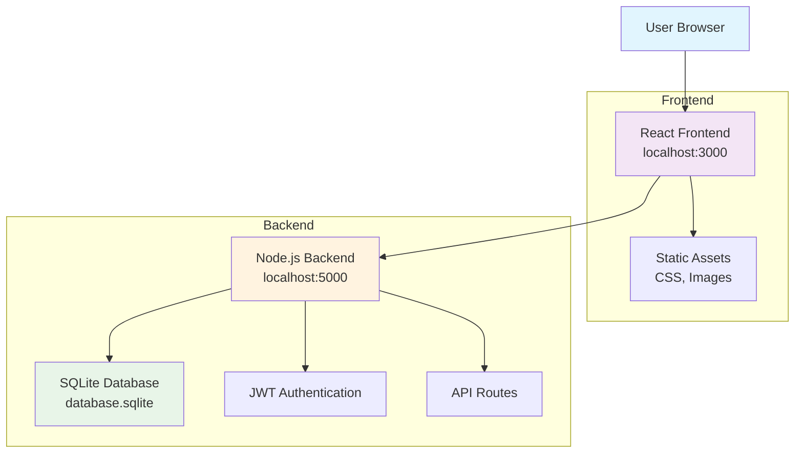

## 📊 Architecture

```mermaid
graph TD
    A[User Browser] --> B[React Frontend<br/>localhost:3000]
    B --> C[Node.js Backend<br/>localhost:5000]
    C --> D[SQLite Database<br/>database.sqlite]
    
    B --> E[Static Assets<br/>CSS, Images]
    C --> F[JWT Authentication]
    C --> G[API Routes]
    
    subgraph Frontend
        B
        E
    end
    
    subgraph Backend
        C
        F
        G
        D
    end
    
    style A fill:#e1f5fe
    style B fill:#f3e5f5
    style C fill:#fff3e0
    style D fill:#e8f5e8
```
